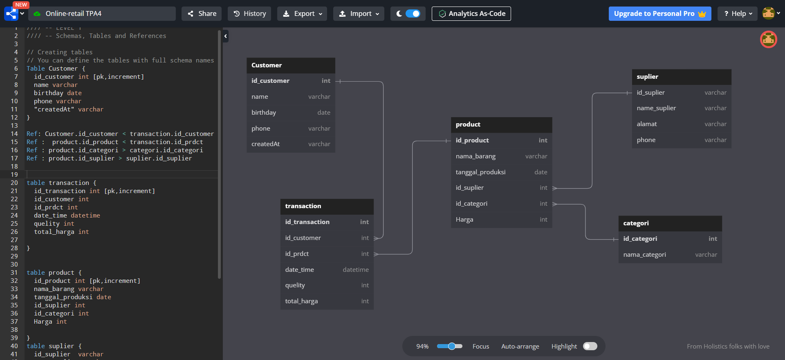

# TPA 4 Technical Project Assignment (TPA) Online Retail Database Design
Link soal dapat diakses [disini](https://github.com/impactbyte/full-stack-web-assignments/tree/master/TPA-004-backend)

## Membuat ERD

Berikut Erd yang telah dibuat : 

Adapun langkah-langkah atau query agar database yang dibuat mirip seperti ERD adalah sebagai berikut
1. [Membuat database](Query/DDL/createdb.sql)
2. [Membuat tabel](Query/DDL/createtable.sql)
3. [Memasukkan data ke tabel](Query/DML/inserttable.sql)

Setelah itu kita dapat menghapus data di tabel sampai dengan database yaitu
- [Menghapus database](Query/DDL/dropdb.sql)
- [Menghapus tabel](Query/DDL/dropTabel.sql)
- [Menghapus data Tabel](Query/DML/deleteDataTabel.sql)

Setelah itu kita dapat melihat atau select data adapun querynya di [Link ini](Query/DML/ambildata.sql)

tidak hanya itu kita juga dapat melakukan updat data seperti di [link query ini](Query/DML/update.sql)

### Di soal terdapat beberapa studi kasus yang harus diselesaikan yaitu 
1. [pelanggan membeli 3 barang yang berbeda.](Query/Soal/no1.sql)
2. [Melihat 3 produk yang paling sering dibeli oleh pelanggan.](Query/Soal/no2.sql)
3. [Melihat Kategori barang yang paling banyak barangnya.](Query/Soal/no3.sql)
4. [Nominal rata-rata transaksi yang dilakukan oleh pelanggan dalam 1 bulan terakhir.](Query/Soal/no4.sql)